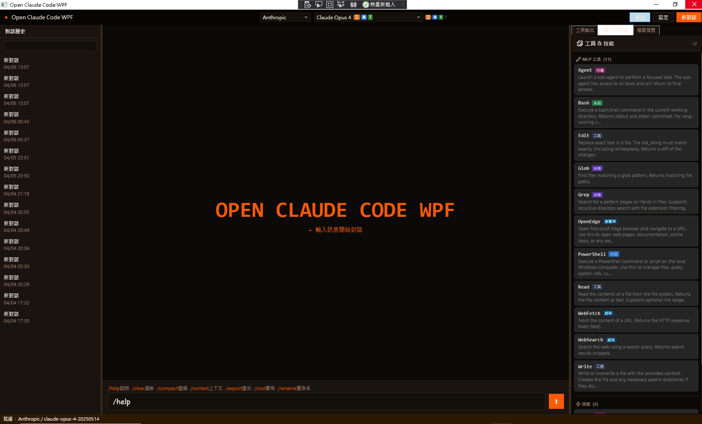

# Open Claude Code WPF

> A Windows desktop AI chat client built with WPF (.NET Framework 4.7.2), supporting multiple AI providers in a single interface.

📖 [繁體中文版](README.md)


---

## 🎬 Demo Video

[](https://www.youtube.com/watch?v=Wp2fpYDPPt0)

> Click the thumbnail above or [watch on YouTube](https://www.youtube.com/watch?v=Wp2fpYDPPt0)

---

## Screenshot



---

## Features

- **Multi-provider support** — Anthropic Claude, OpenAI GPT, Google Gemini, Ollama (local), Azure OpenAI (multi-node)
- **Streaming responses** — real-time token-by-token output
- **Extended thinking** — displays the model's reasoning process in a collapsible panel (for Claude / o1 / o3 series)
- **Tool / Function Calling** — shows tool invocations inline during generation
- **Conversation history** — sessions persisted locally, searchable sidebar
- **Themes** — Light, Dark, Cloude Code (custom orange-accent dark theme)
- **Markdown rendering** — code blocks with syntax highlighting
- **Customisable font** — family and size applied to both chat messages and the input box
- **Model badges** in the dropdown — **工** (tools), **視** (vision), **T** (thinking)

---

## Requirements

| Requirement | Version |
|---|---|
| Windows | 10 / 11 |
| .NET Framework | 4.7.2 or later |
| Visual Studio | 2019 / 2022 (for building) |

---

## Quick Start

### 1. Clone

```bash
git clone <repo-url>
cd open-claude-code-wpf
```

### 2. Restore NuGet packages

Open `OpenClaudeCodeWPF.sln` in Visual Studio, then:

```
Tools → NuGet Package Manager → Restore Packages
```

Or via CLI:

```bash
nuget restore OpenClaudeCodeWPF.sln
```

### 3. Configure API keys

Copy the example config and fill in your keys:

```bash
cp OpenClaudeCodeWPF/App.config.example OpenClaudeCodeWPF/App.config
```

Then edit `App.config`:

```xml
<!-- Anthropic Claude -->
<add key="Anthropic.ApiKey" value="sk-ant-..." />

<!-- OpenAI -->
<add key="OpenAI.ApiKey" value="sk-..." />

<!-- Google Gemini -->
<add key="Gemini.ApiKey" value="AIza..." />

<!-- Ollama (local, no key needed) -->
<add key="Ollama.BaseUrl" value="http://localhost:11434" />

<!-- Azure OpenAI (multi-node, see below) -->
<add key="AzureOpenAI.ApiKey" value="..." />
<add key="AzureOpenAI.Endpoint" value="https://xxx.openai.azure.com" />
<add key="AzureOpenAI.DeploymentName" value="gpt-4o" />
```

> **Tip:** You can also set / change keys at runtime via **Settings → 供應商 API** — they are saved to `%APPDATA%\OpenClaudeCodeWPF\usersettings.json` and do not require a restart.

### 4. Build & Run

Press **F5** in Visual Studio, or:

```bash
msbuild OpenClaudeCodeWPF.sln /p:Configuration=Release
```

The executable will be at `OpenClaudeCodeWPF\bin\Release\OpenClaudeCodeWPF.exe`.

---

## Settings

Open the **設定** button in the toolbar. Settings are organised into four tabs:

| Tab | Contents |
|---|---|
| 🔑 供應商 API | Per-provider API keys, base URLs, Ollama model list, Azure multi-node |
| ⚙️ 模型參數 | Temperature, Max Tokens, streaming toggle, language |
| 🎨 介面 | Theme selector, font family, font size |
| 📝 系統提示 | Custom system prompt |

Settings are auto-saved to `%APPDATA%\OpenClaudeCodeWPF\usersettings.json`.

---

## Azure OpenAI Multi-node

In **Settings → 供應商 API → Azure OpenAI**，each line represents one deployment node:

```
名稱|Endpoint URL|API金鑰|部署名稱|API版本
East US|https://myhub-eastus.openai.azure.com|sk-xxx|gpt-4o|2024-02-01
Japan East|https://myhub-japan.openai.azure.com|sk-yyy|gpt-4o-mini|2024-02-01
```

After saving, each node appears as a selectable model in the model dropdown.

---

## Ollama (Local Models)

1. Start Ollama: `ollama serve`
2. Pull a model: `ollama pull llama3`
3. In settings, set **Ollama Base URL** to `http://localhost:11434`
4. Leave **Custom Models** blank to auto-detect, or list model IDs one per line:
   ```
   llama3
   mistral
   codellama
   ```

---

## Model Badges

| Badge | Colour | Meaning |
|---|---|---|
| **工** | Orange | Supports Function Calling (Tool Use) |
| **視** | Blue | Supports Vision / Multimodal input |
| **T** | Green | Supports Extended Thinking (reasoning) |

Hover over the badge legend `工 視 T ?` next to the model dropdown for a quick reminder.

---

## Architecture (MVVM)

This project follows the **MVVM (Model-View-ViewModel)** pattern, cleanly separating UI presentation from business logic.


| Layer | Responsibility |
|---|---|
| **Views** | XAML-only presentation; communicate with ViewModels exclusively through DataBinding and Commands |
| **ViewModels** | Extend `ViewModelBase` (`INotifyPropertyChanged`); hold all UI state and `ICommand` implementations; never reference a View directly |
| **Services** | Stateless business logic (API calls, settings persistence, theme management); invoked by ViewModels |

### ViewModel Mapping

| ViewModel | View | Responsibilities |
|---|---|---|
| `MainWindowViewModel` | `MainWindow.xaml` | Status bar, provider/model selection, streaming toggle, context usage indicator |
| `ChatViewModel` | `ChatPanel.xaml` | Input text, Send/Cancel commands, slash-command hint visibility |
| `SettingsViewModel` | `SettingsPanel.xaml` | All settings properties (API keys, font, theme, temperature) — Load & Save |
| `HistoryViewModel` | `HistoryPanel.xaml` | Session list filtering, search, selection notification back to MainWindow |

---

## Agent Processing Model (ReAct)

The agent core follows the **ReAct (Reasoning + Acting)** pattern — the model alternates between reasoning and acting until the task is complete.


### Flow

```
User input
  └─ [Reason] LLM generates a response (may include tool_calls)
       └─ [Act]    ToolOrchestrator executes tools, returns Observation
            └─ [Reason] LLM sees results, reasons again
                 └─ [Act]    Execute next batch of tools
                      └─ ... (up to 20 rounds)
                           └─ LLM stops calling tools → outputs final reply
```

### Two ReAct Implementations

| Implementation | Use Case | Max Iterations | Status |
|---|---|---|---|
| **ChatService main loop** (API Function Calling) | Models with native tool-call support: Claude / GPT / Gemini | **20 rounds** | ✅ Active in main flow |
| **ReActEngine** (plain-text format) | Models without Function Calling (older Ollama) | **15 rounds** | ⚠️ Implemented, not yet wired |

ReActEngine communicates with the LLM using the classic text protocol:

```
Thought:       [model's reasoning]
Action:        [tool name]
Action Input:  {"param": "value"}
Observation:   [tool result]
... repeats until ...
Final Answer:  [final response]
```

### Sub-agent Recursion

`AgentTool` lets the main agent spin up a sub-agent to handle a focused sub-task:

```
Main Agent (max 20 rounds)
  └─ calls AgentTool
       └─ spawns new ChatService → RunSingleAsync
            └─ Sub-agent (max 20 rounds, has all tools)
                 └─ may call AgentTool again → Grandchild agent
                      └─ no hard depth limit
```

> **Note:** There is currently no hard recursion depth limit. In practice, the LLM rarely goes beyond 2–3 levels spontaneously. A `depth` guard can be added to `AgentTool` to prevent runaway recursion.

---

## Project Structure

```
OpenClaudeCodeWPF/
├── Models/              # Data models (ChatMessage, ModelInfo, StreamEvent …)
├── Services/
│   ├── Providers/       # One file per AI provider
│   ├── ConfigService.cs # Central settings (App.config + runtime overrides)
│   ├── UserSettingsService.cs  # Persists settings to JSON
│   ├── ThemeService.cs  # Theme management
│   ├── ChatService.cs   # Orchestrates provider calls & streaming
│   └── …
├── ViewModels/          # MVVM ViewModel layer
│   ├── ViewModelBase.cs          # INotifyPropertyChanged base class
│   ├── RelayCommand.cs           # ICommand implementation
│   ├── MainWindowViewModel.cs    # Main window state
│   ├── ChatViewModel.cs          # Chat input state & commands
│   ├── SettingsViewModel.cs      # Settings panel state
│   └── HistoryViewModel.cs       # History panel state
├── Views/
│   ├── ChatPanel.xaml   # Main conversation area
│   ├── SettingsPanel.xaml
│   ├── HistoryPanel.xaml
│   └── …
├── App.xaml             # Global resources & styles
├── MainWindow.xaml      # Shell: toolbar + provider/model selectors
└── App.config           # Default configuration (keys go here or in Settings UI)
```

---

## Privacy & Security

- **`App.config`** is git-ignored — never committed. Copy `App.config.example` to `App.config` and fill in your keys locally.
- You can also set keys at runtime via **Settings → 供應商 API**; they are saved to `%APPDATA%\OpenClaudeCodeWPF\usersettings.json` (also gitignored).
- Conversation history is stored locally in `%APPDATA%\OpenClaudeCodeWPF\`.
- No telemetry is collected.

---

## License

MIT
